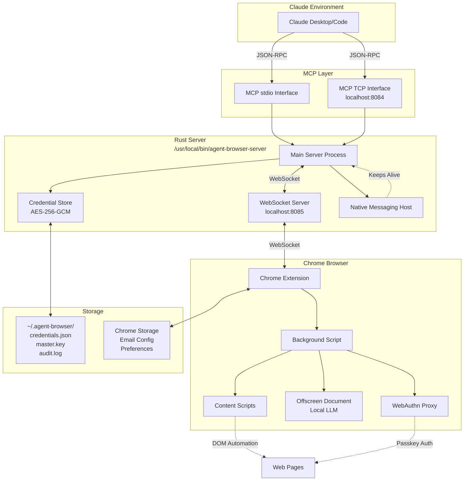
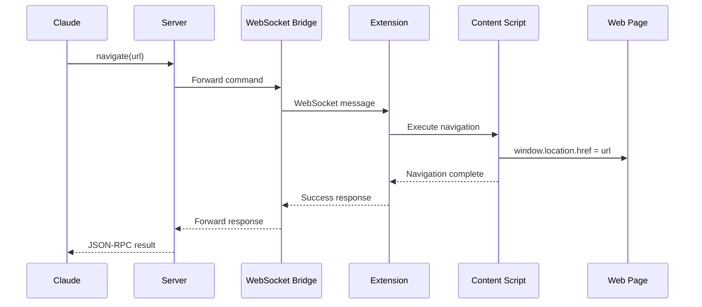
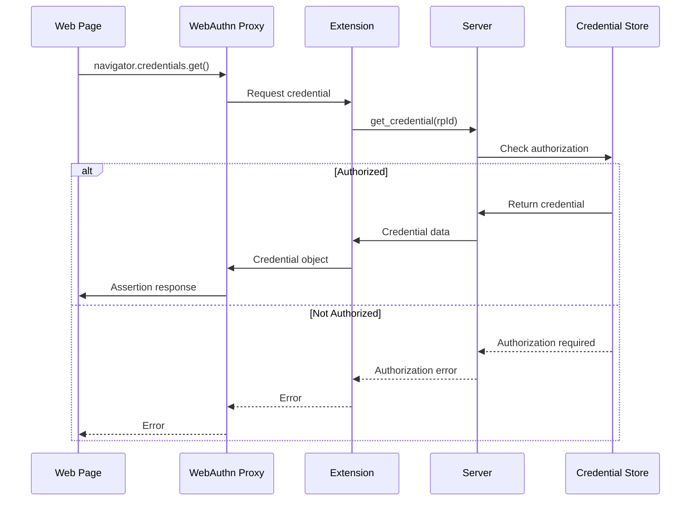
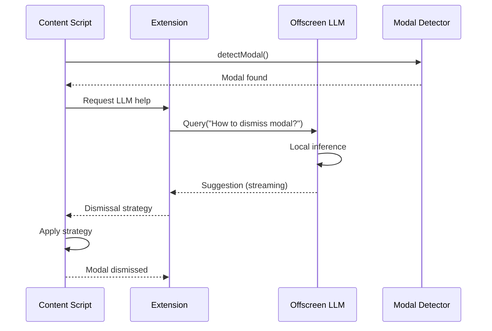
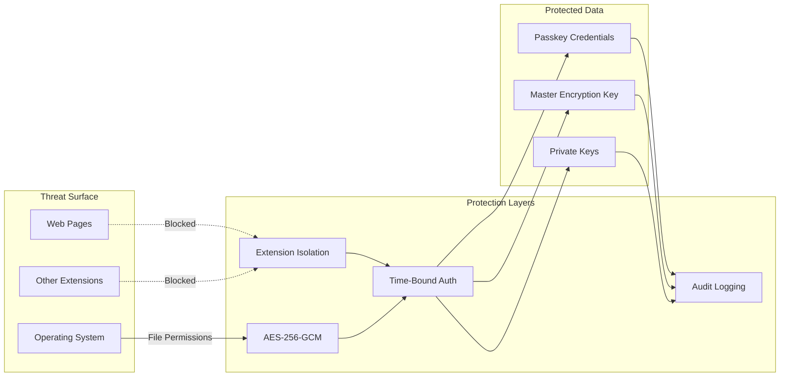

# Architecture

Agent Browser consists of three main components that work together to provide MCP-based browser automation.

## System Architecture



## Component Details

### 1. MCP Interfaces

The Rust server exposes two MCP interfaces:

- **stdio**: Used by Claude Desktop/Code via `MCP_STDIO=1`
- **TCP**: Available on `localhost:8084` via `MCP_TCP=1`

Both interfaces accept JSON-RPC requests and route them to the Chrome extension via WebSocket.

### 2. Rust Server

Core responsibilities:

- **MCP Protocol Handler**: Parses JSON-RPC requests from Claude
- **WebSocket Bridge**: Forwards commands to Chrome extension on port 8085
- **Credential Store**: Manages encrypted passkey storage with time-bound authorization
- **Native Messaging Host**: Ensures server runs when Chrome is active

### 3. Chrome Extension

Multi-component extension:

- **Background Script**: Coordinates between MCP server and content scripts
- **Content Scripts**: Execute DOM automation in web pages
- **Offscreen Document**: Hosts local LLM (Gemma 3N) for automation assistance
- **WebAuthn Proxy**: Intercepts and manages passkey credential requests

### 4. Storage Layer

Two independent storage systems:

- **Local Filesystem** (`~/.agent-browser/`):
  - `credentials.json`: Encrypted passkey credentials
  - `master.key`: AES-256-GCM encryption key (0600 permissions)
  - `audit.log`: Credential access audit trail

- **Chrome Storage**:
  - Email provider configuration (IMAP/OAuth)
  - Automation preferences and delays
  - Authorization window settings

## Data Flow

### Browser Automation Request



### Passkey Authentication Request



### LLM-Assisted Automation



## Security Architecture

### Credential Protection



### Authorization Flow

1. User requests passkey usage
2. Extension checks session authorization status
3. If expired, prompts for authorization with duration
4. Server validates and grants time-bound access
5. All credential operations logged to audit.log
6. Authorization automatically expires after duration

## Communication Protocols

### MCP JSON-RPC

```json
{
  "jsonrpc": "2.0",
  "id": "1",
  "method": "tools/call",
  "params": {
    "name": "navigate",
    "arguments": {
      "url": "https://example.com"
    }
  }
}
```

### WebSocket Messages

```json
{
  "type": "command",
  "id": "cmd_abc123",
  "method": "click",
  "params": {
    "selector": "#submit-button",
    "mode": "stealth"
  }
}
```

### Chrome Extension Messages

```json
{
  "type": "llm_query_request",
  "id": "llm_xyz789",
  "prompt": "How do I dismiss this GDPR modal?",
  "screenshot": "data:image/png;base64,..."
}
```

## Performance Characteristics

- **WebSocket latency**: <5ms (localhost)
- **MCP command overhead**: 10-20ms
- **Modal detection**: 50-200ms
- **LLM inference**: 1-3s per query (local)
- **Credential decryption**: <10ms

## Scalability

Current architecture is single-user, single-browser:

- One server instance per user
- One WebSocket connection to extension
- Sequential command processing
- Local-only LLM inference

Future improvements could include:

- Multi-browser support (Firefox, Safari)
- Concurrent command execution
- Remote LLM option for faster inference
- Distributed credential storage
